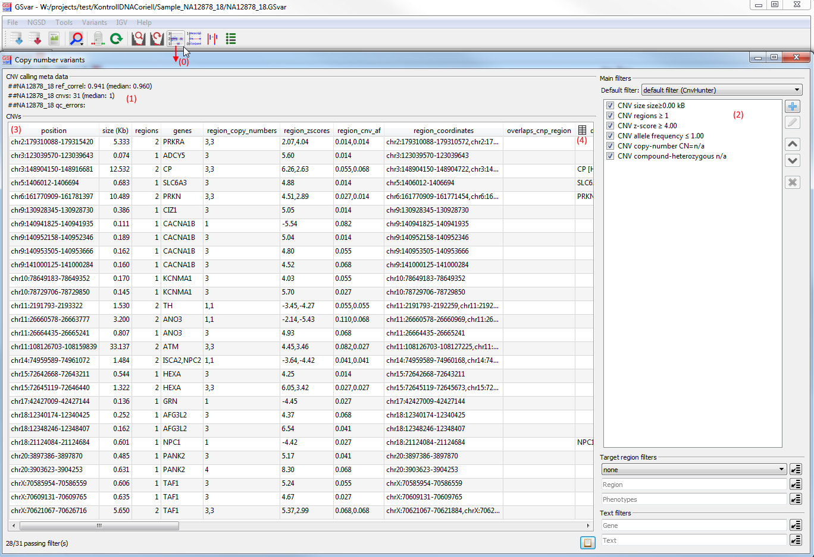
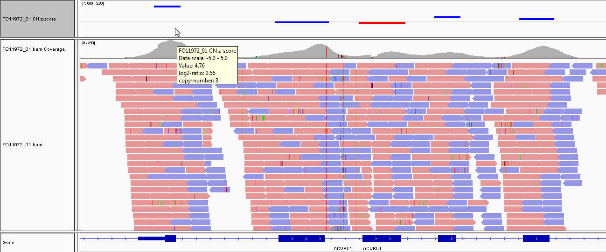
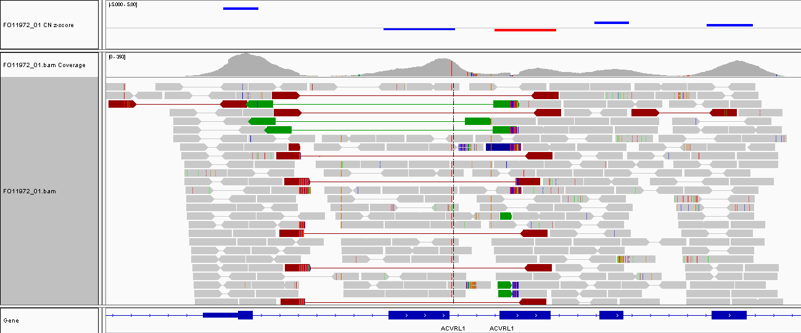

## CNV analysis for panels 

CnvHunter is designed for targeted NGS sequencing, where exon target regions alternate with non-target intron regions. Thus, a single copy-number variant can consist of several subsequent regions (i.e. exons). For each region, the copy-number state and the [z-score](https://en.wikipedia.org/wiki/Standard_score) indicating the significance are listed (see screenshot in the 'CNV filtering' section).

### CNV analysis quality

Visualization and filtering of CNVs is done in the "Copy-number variants" dialog, which is shown below.
The dialog is opened from the main tool bar (0). 

In the upper part of the dialog (1), sample-specific information about the CNV calling is shown. It gives an impression  of the sample quality:

* Reference sample correlation (and mean reference sample correlation of all samples)
* Number of CNVs detected (and mean number of CNVs for all samples)
* QC errors: If CNV calling was skipped because of QC problems, the reason is shown here. Common problems are:
	* Low reference sample correlation (indicated by 'corr' entry)
	* Low average depth on the target region (indicated by 'avg_depth' entry)

### CNV filtering

On the right side, default filters can be selected and modified (2).

For each CNV the following properties are shown (3):

* genomic position
* size (kB)
* region count (exons)
* affected genes
* copy-number state (one per region)
* z-score (one per region)
* frequency in the analyzed dataset independent of the copy-number state (one per region)

Additionally, generic annotation columns can be added (4), e.g.:

* overlap cnps_genomes_imgag: overlap with copy-number polymorphism regions from IMGAG - allele-freqency in cohort in brackets (generated by [ClinCNV](https://github.com/imgag/ClinCNV) based on in-house genomes)  
* overlap afs_genomes_imgag: overlap with AF>2% CNV regions from NGSD - AF of CNV(s) in brackets (generated from NGSD based on 550 high-quality genomes)
* cn_pathogenic: in-house database of pathogenic CNVs
* dosage_sensitive_disease_genes: dosage-sensitive disease genes (from [ClinGen Dosage Sensitivity Map](https://www.ncbi.nlm.nih.gov/projects/dbvar/clingen/))
* OMIM genes
* gene_info: gene-specific information from NGSD
	* gnomAD o/e score for LOF variants
	* overlap with gene (complete, intronic/intergenic, exonic/splicing)

More information about a copy-number variant can be found through the resources linked in the context menu (5). 

### Visualizing copy-number data in IGV

*Double-clicking* a CNV in the dialog, opens the CNV region in IGV (see also section [IGV integration](igv_integration.md)).

If the sample folder contains a SEG file, this file can be shown as CNV track in IGV. The default visualization is in points style. In this style gains (z-score>0) are shown in blue and losses (z-score<0) are shown in red.

In addition to the z-score which is vizualized, the CNV track also contains the log2-ratio and copy-number, which are shown as a tooltip when hovering over a region. In this screenshot the first exon of the ACVRL1 gene is duplicated (z-score=4.76).

We can adapt the IGV settings of the BAM track to visualize the breakpoints created by a copy-number variant (if they lie inside the target region):

* Open perferences dialog `View > Preferences` and on the `Alignments` tab, enable `Show soft-clipped bases`.
* Right-click on the BAM track and enable `View as pairs`.
* Right-click on the BAM track and enable `Color alignments by > Insert size and pair orientation`. 

Then, it is clear that in this case there is a tandem duplication of the region from exon 1 to exon 3.

--

[back to main CNV page](cnv_analysis.md)
