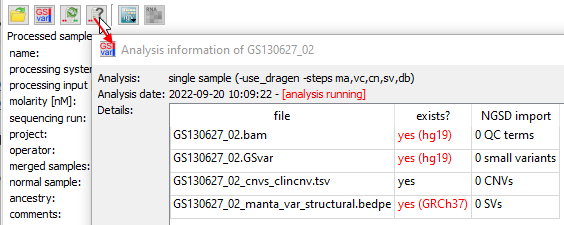

# Data analysis

## What are the analysis steps of the different pipelines?

### germline - single sample pipeline

The germline single-sample pipeline is used to analyze a single case.  
It consists of read mapping and several variant calling and annotation steps:

- **Mapping**: Assignment of reads to the position in the reference genome where they come from (mapping).  
  Part of the mapping is also determine the alignment of the read to the reference genome sequence in case it does not match completely.
- **Variant calling**: Detection of deviations from the reference genome sequence.  
  Here seperate variant callers are used for small variants, CNVs, structural variants, repeat expansions, etc.
- **Annotation**: Addition of information from tools and databases to allow interpretetion of the variant like consequence on cDNA/protein level, fequency in populations, pathogenicity predictions, splicing effect prediction, etc.  
  Most of this information comes from databases, e.g. 1000 Genomes, gnomAD, ClinVar, HGMD, OMIM.

The following image shows a simplified single sample pipeline:

### germline - multi-sample pipeline / trio pipeline

Multi-sample and trio analyses are bases on mapped reads (BAM file), which is usually generated using the single-sample pipeline.  
On the BAM files the joined variant calling is preformed for all samples.  
Here an example of a multi-sample analysis with two samples:

## What is the difference between re-annotation and a normal analysis.

When performing reannotation (e.g. by checking the box `annotate only` in the single-sample analysis dialog) the variant calling step is skipped.  
Existing variant calls are used and annotations are updated.

This is usually done when the annotation data is older than a few months.  
Up-to-data annotation data is important as public databases (ClinVar, HGMD, OMIM, ...) are updated regularly.

## Where can I trigger analysis jobs?

You can trigger the (re-)analysis of the processed samples from several places in GSvar.

###Analysis status tab

The `analysis status` tab is opened from the GSvar tool bar ():

Here you see all analysis jobs and their current status.

In the upper right corner of the tab, you find buttons to queue the analysis of:

- single sample analysis
- trios analysis
- multi-sample analysis
- somatic analysis

### Processed sample tab

In the upper part of the `processed sample` tab, you can (re-)start the single-sample analysis of the processed sample using the button ().  

### Main tool bar

In the main tool bar, you can restart the analysis of the currently open GSvar file using the button ().  
This works for all analysis types:

- single sample analysis
- trios analysis
- multi-sample analysis
- somatic analysis

### Sample search

The `sample search` can be opened via the main menu bar of GSvar ().  
Here processed samples can be searched for, e.g. of a project, run or processing system.  
Through the context menu of the search results, a batch of samples can be analyzed.

## Where can I see the analysis progress?

The analysis status and progress of individual samples can be shown using the button .  
It is available from tool bar of the `processed sample tab` and through the context menu of `analysis status` table.

Here you can also see if the sample was already analyzed on HG38.  
If not you see several warnings:  

--

[back to main page](index.md)
