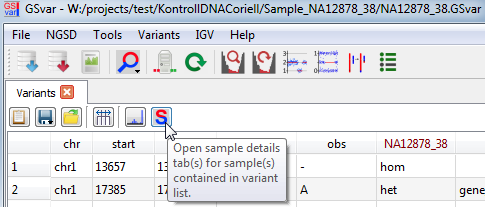
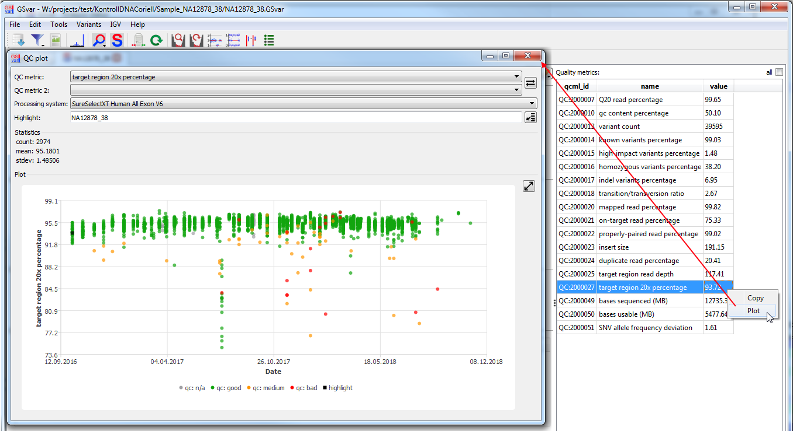
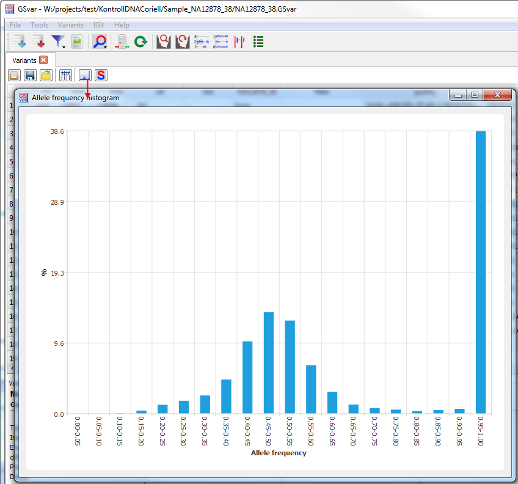
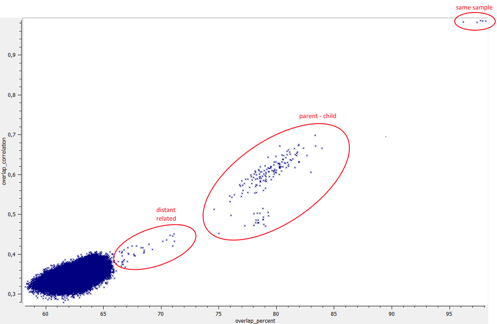

## Sample quality control

### Assessing quality by NGS QC metrics

To open the processed sample tabs of the all samples contained in the variant list use the main tool bar (1).  
By default, it shows the most important quality metrics. All quality metrics can be shown using the `all` checkbox (2).  
Details about the metrics can be shown in the tooltip of the metrics names (3).  

For some of the quality metrics, fixed default cutoffs are applied and values exceeding these scores are marked orange/red:

- target region read depth
- target region 20x percentage
- known variants percentage
- SNV allele frequency deviation

The colors do not necessarily mean that that sample is bad, because the scores depend on the processing system.  
Make sure to have a look at the value distribution of the metric in other samples (see plotting section).

### Plotting quality scores

The processed sample tab shows QC metrics for a single sample only.  
To show the distribution of the metric over time, use the `Plot` context menu entry:

If two metrics are selected, a scatter plot of the two metris is shown.  
For example, a low 20x coverage is normally caused by a low sequencing depth.
The normal ratio between average depth and 20x coverage can be best seen in this plot:
Here an example: 

### Checking sample contamination

The `SNV allele frequency deviation` score indicates sample contamination, by looking at the percentage of SNVs that fall outside the expected allele frequency windows around 0.0, 0.5 or 1.0. This score should not be used for tumor samples.

A histogram of the allele frequency can be shown using the button in the main tool bar.  
This example shows how it should look like for a high quality exome. 

### Checking sample gender

The sample gender can be easily checked from GSvar:

For exomes and panels that contain the SRY gene, please use the method based on the SRY gene.  
If you are not sure if your panel contains the SRY gene, you can check the target region using IGV.  

### Checking sample similarity

If you have related samples and want to check how similar they are, you can do this from GSvar as well:

The method based on the GSvar file is faster and should be used for most cases.  
SampleSimilarity calculates several metrics that measure how similar two samples are:

 * overlap: Percentage of variants that occur in both samples - not considering the genotype (only in VCF mode).
 * correlation: Correlation of variant genotypes.
 * ibs0: Percentage of variants with zero IBS, e.g. AA and CC (only in BAM mode).
 * ibs2: Percentage of variants with complete IBS, e.g. AA and AA.

Absolute cutoffs values for for same sample, parent-child pairs etc. do not exist, since they depend on ehtnicity, enrichment kit, etc.   
Example data for exome data (Agilent SureSelect Human All Exon V6) are shown here:

--

[back to main page](index.md)

