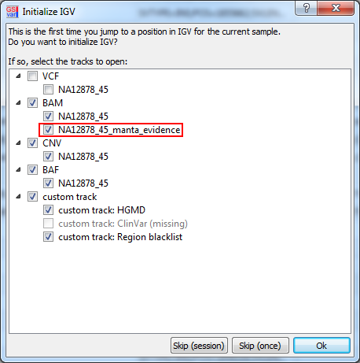
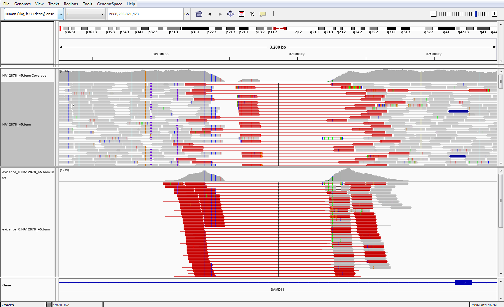

## SV analysis

Structural variant (SV) calling is performed based on paired-end reads which are mapped on different areas or in different orientations.
There are five different structural variants which are detected by a characteristic paired-end read pattern:

Deletions can be detected by paired-end reads which overlap the deletion. After mapping one mate of these reads is mapped to the start of the deletion and the other mate to the end of the deletion. 

Tandem duplications can be detected by reads which overlap the end of the original segment and the start of the duplication. In the genome mapping one mate of these reads is mapped to the start of the duplicated segment and the other to the end of the duplicated segment, but both in opposite orientation. Non-tandem duplications are detected similarly: Here reads which overlaps the start and end of the inserted duplication are necessary. In the genome mapping one mate of these reads is mapped right before the start of the inserted duplicate and the other mate to the start of original duplicated segment (in case the read overlaps the start) or one mate is mapped to the end of the duplicated and the other mate is mapped right behind the end of the inserted duplicate (in case the read overlaps the end).

Inversions are detected by reads which overlap either the start or the end of a inverted segment. In the genome mapping one mate of these reads is mapped right before the start of the inversion and the other mate is mapped to the end of the inverted segment in opposite orientation (in case the read overlaps the start) or one mate is mapped to right behind the inversion and the other mate is mapped to the start of the inverted segment in opposite orientation (in case the read overlaps the end).

To detect translocations again reads are required which overlap the start and end position of the translocation and reads which overlap the original position of the translocated segment. During mapping one mate of reads which overlap the start and end position of the translocated segment is mapped right before/after the translocation and the other mate is mapped to the start/end of the translocated segment. Additionally one mate of reads which overlap the original position is mapped right before the translocated segment and the other mate right behind it (similar to a deletion of this segment).

For the detection of insertions reads which overlap the start and end of the insertion. After mapping one mate of these reads is mapped right before/after the insertion whereas the other mate cannot be mapped to the reference.

## Details

For SV calling [Manta](https://github.com/Illumina/manta) is used.

## SV analysis window

The visualization and filtering of is done with the "Structural variants" dialog which can be started from the main menu:

The "Structural variants" dialog shows the filtered list of all detected SVs with all annotations in the top left table view (1). For each SV the following values are shown:

* genomic position
* quality
* SV type
* filter
* sequence of the reference
* sequence of the SV
* genes
* gene info: gene-specific information from NGSD
	* gnomAD o/e score for LOF variants
	* overlap with gene (complete, intronic/intergenic, exonic/splicing) 
* NGSD count: number of exact matches in the NGSD and the allele frequency in brackets
* NGSD overlap: number of SVs in the NGSD which overlap the SV
* OMIM genes	

Additionally the Format and Info columns of the currently selected SV is expanded below this table (2). On the right side there is a filter widget similar to the variant or CNV view where filters can be added and modified (3). Below that the target, chromosomal or phenotype region can be defined and the SVs filtered by genes or text (4). 

## Filtering

A set of default filters can be loaded by selecting *germline* in the drop-down menu above the filter widget (3). Since the useful filter settings highly depends on the sample, most of the filters are deactivated by default and can be activated by checking the corresponding checkbox. Seven filters are added by default:

* *SV remove chr type*: This filter is enabled by default and removes all structural variants which are located on non-standard chromosomes.
* *SV type*: This filter is enabled by default, but contains all available SV types. It can be modified to limit the analysis to a certain set of SV types (e.g. only analyse deletions).
* *SV filter columns REMOVE: off-target*: Only useful for samples with a target region (e.g. WES). Removes all SVs which are marked as *off-target* (SV is located outside the target region).
* *SV filter columns FILTER: PASS*: Removes all SVs which do not pass the QC of the SV caller.
* *SV quality ≥ 30*: Removes low-quality SVs.
* *SV size ≥ 100 bases*: Removes all small SVs.
* *SV OMIM genes*: Removes all SVs which do not overlap with an OMIM gene.

A list of all available filters can be found here: [SvFilterAnnotation](https://github.com/imgag/ngs-bits/blob/master/doc/tools/SvFilterAnnotations.md)

## IGV

A double click on a structural variant will open this variant in IGV. In case of a translocation a double click will open only the first breakpoint. To display the second breakpoint right click and select *Open position B in IGV* or *Open position A/B in IGV split screen*. In the following dialog select the Manta evidence BAM file (starting with *evidence_*):

In IGV you have now two tracks of reads. One contains all the reads of the selected area and the other contains only reads wihich were used by Manta as evidence to call the selected structural variance:

The following view settings are recommended and can be selected by right clicking on a BAM track and selecting the corresponding menu entries:

* *View as pairs* connects each read with its mats by a line and shows them together.
* *Color Alignments by* -> *insert size and pair orientation* colors with high insert size or wrong read orientation.
* *Collapsed*/*Squished* reduces the height for each read which allows to display more reads. This can be useful depending on sample depth and display resolution.
* *Group alignments by* -> *chromosomes of mate* can be usful to visualize translocations.

## FAQ

### (Re-)start SV analysis

The SV (re-)analysis can be started by clicking on the 6th button of the GSvar toolbar. Here the structural variant calling step has to be selected. (For samples which has been mapped with an older megSAP version the mapping step has to be selected, too.)

--

[back to main page](index.md)

