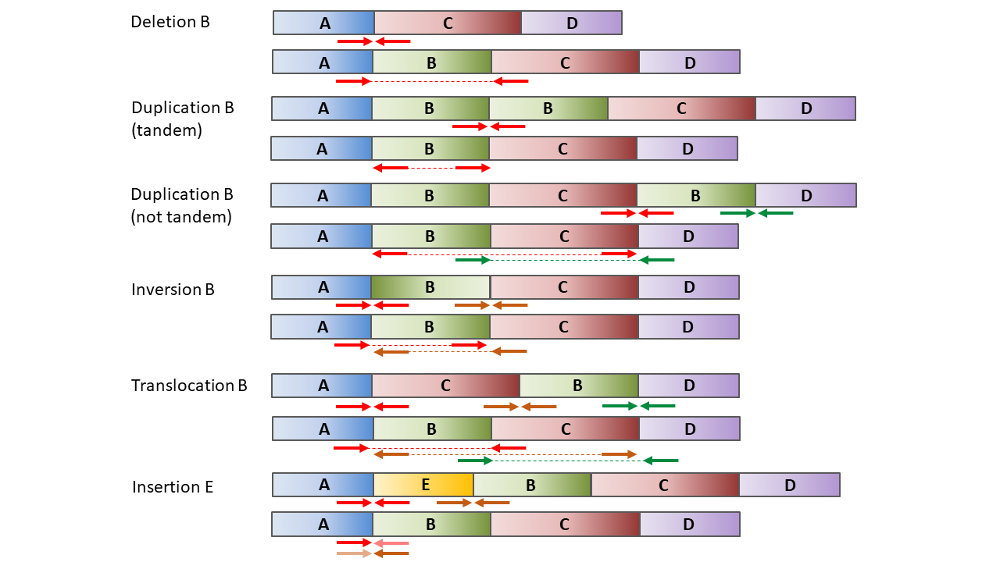

## SV analysis

Structural variant (SV) calling is performed based on paired-end reads which are mapped on different areas or in different orientations.
There are five different structural variants which are detected by a characteristic paired-end read pattern:

Deletions can be detected by paired-end reads which overlap the deletion. After mapping one mate of these reads is mapped to the start of the deletion and the other mate to the end of the deletion. 

Tandem duplications can be detected by reads which overlap the end of the original segment and the start of the duplication. In the genome mapping one mate of these reads is mapped to the start of the duplicated segment and the other to the end of the duplicated segment, but both in opposite orientation. Non-tandem duplications are detected similarly: Here reads which overlaps the start and end of the inserted duplication are necessary. In the genome mapping one mate of these reads is mapped right before the start of the inserted duplicate and the other mate to the start of original duplicated segment (in case the read overlaps the start) or one mate is mapped to the end of the duplicated and the other mate is mapped right behind the end of the inserted duplicate (in case the read overlaps the end).

Inversions are detected by reads which overlap either the start or the end of a inverted segment. In the genome mapping one mate of these reads is mapped right before the start of the inversion and the other mate is mapped to the end of the inverted segment in opposite orientation (in case the read overlaps the start) or one mate is mapped to right behind the inversion and the other mate is mapped to the start of the inverted segment in opposite orientation (in case the read overlaps the end).

To detect translocations again reads are required which overlap the start and end position of the translocation and reads which overlap the original position of the translocated segment. During mapping one mate of reads which overlap the start and end position of the translocated segment is mapped right before/after the translocation and the other mate is mapped to the start/end of the translocated segment. Additionally one mate of reads which overlap the original position is mapped right before the translocated segment and the other mate right behind it (similar to a deletion of this segment).

For the detection of insertions reads which overlap the start and end of the insertion. After mapping one mate of these reads is mapped right before/after the insertion whereas the other mate cannot be mapped to the reference.

## Details

For SV calling [Manta](https://github.com/Illumina/manta) is used.

## SV analysis window

The visualization and filtering of is done with the "Structural variants" dialog which can be started from the main menu:

The "Structural variants" dialog shows the filtered list of all detected SVs with all annotations in the top left table view (1). For each SV the following values are shown:

* genomic position
* quality
* SV type
* filter
* sequence of the reference
* sequence of the SV
* genes
* gene info: gene-specific information from NGSD
	* gnomAD o/e score for LOF variants
	* overlap with gene (complete, intronic/intergenic, exonic/splicing) 
* NGSD count: number of exact matches in the NGSD and the allele frequency in brackets
* NGSD overlap: number of SVs in the NGSD which overlap the SV
* OMIM genes	

Additionally the Format and Info columns of the currently selected SV is expanded below this table (2). On the right side there is a filter widget similar to the variant or CNV view where filters can be added and modified (3). Below that the target, chromosomal or phenotype region can be defined and the SVs filtered by genes or text (4). 

## FAQ

### (Re-)start SV analysis

The SV (re-)analysis can be started 

--

[back to main page](index.md)

